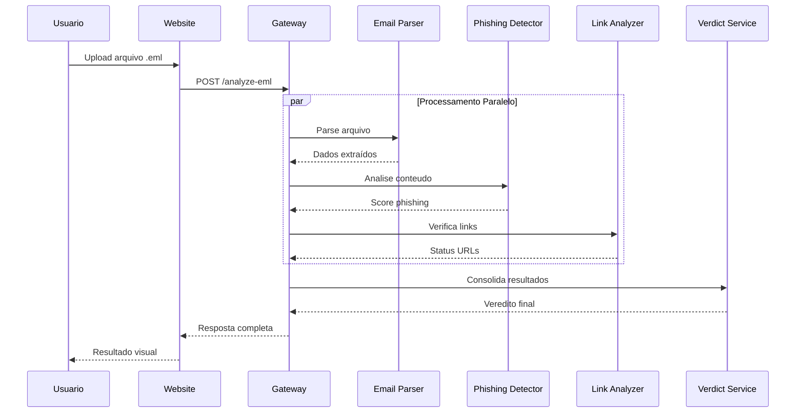

# Phishing Detector - Docker Setup Completo

## 📁 Estrutura do Projeto

Todos os serviços estão dockerizados e podem ser executados com um único comando:

- **Website** (Frontend): HTML/CSS/JavaScript servido via nginx
- **Gateway** (API Principal): Coordena todos os outros serviços  
- **Email Parser**: Processa arquivos .eml
- **Phishing Detector**: Analisa conteúdo de phishing
- **Link Analyzer**: Analisa links suspeitos
- **Verdict Service**: Gera veredito final

## 🚀 Como Usar

### 1. Subir todos os serviços

```bash
cd backend
docker-compose up --build
```

### 2. Acessar os serviços

- 🌐 **Website**: http://phishing-detector.localhost
- 🔗 **API Gateway**: http://localhost:5000
- 📧 **Email Parser**: http://localhost:5001
- 🛡️ **Phishing Detector**: http://localhost:5002
- 🔍 **Link Analyzer**: http://localhost:5003
- ⚖️ **Verdict Service**: http://localhost:5004

### 3. Parar os serviços

```bash
docker-compose down
```

### 4. Rebuild apenas um serviço específico

```bash
# Exemplo: rebuild só o website
docker-compose build website

# Ou rebuild e restart um serviço específico
docker-compose up --build website
```

## 🔧 Configurações

### Website
- **Servidor**: nginx alpine
- **Porta**: 8080
- **Arquivos**: Servidos estaticamente

### Backend Services
- **Linguagem**: Python/Flask
- **Rede**: phishing-net (bridge)
- **Volumes**: Hot reload para desenvolvimento

## 🌐 Como Funciona

1. O usuário acessa o website em http://phishing-detector.localhost
2. Faz upload de um arquivo .eml através da interface
3. O JavaScript envia o arquivo para a API Gateway (localhost:5000)
4. O Gateway coordena a análise com todos os microserviços
5. O resultado é exibido na página de resposta

## 🔄 Desenvolvimento

Para desenvolver o website, você pode:
- Usar o Docker (recomendado para teste completo)
- Ou abrir diretamente no navegador para desenvolvimento de frontend

O JavaScript detecta automaticamente o ambiente e ajusta as URLs da API.

## 📝 Notas Importantes

- Certifique-se de ter o Docker e Docker Compose instalados
- A primeira execução pode demorar mais devido ao download das imagens
- Os logs de todos os serviços aparecerão no terminal
- Use Ctrl+C para parar todos os serviços

---

# 🎯 Arquitetura Distribuída de Detecção de Ameaças

## 📖 Visão Geral do Projeto

O **Phishing Detector** é um sistema distribuído avançado projetado para detectar e analisar tentativas de phishing através de emails. O sistema utiliza uma arquitetura de microserviços que oferece alta escalabilidade, manutenibilidade e resiliência para processar e analisar ameaças de segurança em tempo real.

### 🎨 Propósito Principal

O objetivo central é criar uma solução robusta que possa:
- Analisar arquivos de email (.eml) de forma automatizada
- Detectar padrões de phishing usando inteligência artificial
- Avaliar links suspeitos em tempo real
- Fornecer vereditos precisos sobre a legitimidade de emails
- Escalar horizontalmente conforme a demanda aumenta

## 🏗️ Por Que Uma Arquitetura Distribuída?

### 1. **Separação de Responsabilidades (Single Responsibility Principle)**

Cada microserviço tem uma única responsabilidade bem definida:

```
📧 Email Parser      → Extração e parsing de arquivos .eml
🛡️ Phishing Detector → Análise de conteúdo malicioso
🔍 Link Analyzer     → Verificação de URLs suspeitas
⚖️ Verdict Service   → Consolidação de resultados
🌐 Gateway           → Orquestração e coordenação
```

**Vantagem**: Facilita manutenção, testes e desenvolvimento independente de cada componente.

### 2. **Escalabilidade Horizontal Dinâmica**

Em um ambiente de produção, diferentes serviços podem ter demandas distintas:

- **Email Parser**: Pode precisar de mais instâncias durante picos de upload
- **Link Analyzer**: Requer mais recursos para verificação de URLs em tempo real
- **Phishing Detector**: Demanda processamento intensivo de IA

**Solução Distribuída**:
```yaml
# Exemplo de escalonamento com Docker Swarm/Kubernetes
services:
  phishing-detector:
    replicas: 5  # Mais instâncias para IA
  link-analyzer:
    replicas: 3  # Moderado para análise de links
  email-parser:
    replicas: 2  # Básico para parsing
```

### 3. **Tolerância a Falhas e Resiliência**

Se um serviço falha, os outros continuam operando:

```python
# Gateway com circuit breaker pattern
async def analyze_with_fallback():
    try:
        result = await phishing_detector.analyze()
    except ServiceUnavailable:
        # Fallback para análise básica
        result = await basic_pattern_matcher.analyze()
    return result
```

**Vantagem**: O sistema permanece parcialmente funcional mesmo com falhas pontuais.

### 4. **Tecnologias Específicas por Domínio**

Cada serviço pode usar a melhor tecnologia para sua função:

- **Email Parser**: Python + bibliotecas especializadas (email, mailparser)
- **Phishing Detector**: Python + TensorFlow/PyTorch para ML
- **Link Analyzer**: Node.js para requests assíncronos rápidos
- **Frontend**: Nginx + JavaScript puro para performance

### 5. **Desenvolvimento e Deploy Independente**

Equipes podem trabalhar simultaneamente:

```bash
# Time A: Melhorando o detector de phishing
cd phishing-detector/
docker-compose up phishing-detector

# Time B: Otimizando o parser de email
cd email-parser/
docker-compose up email-parser
```

**Vantagem**: Ciclos de desenvolvimento mais rápidos e deploy contínuo.

## 🔄 Fluxo de Processamento Distribuído

### Sequência de Análise Completa



### Processamento Assíncrono e Paralelo

```python
# Gateway orquestrando análises paralelas
async def comprehensive_analysis(email_data):
    # Execução paralela de múltiplas análises
    tasks = [
        phishing_detector.analyze(email_data),
        link_analyzer.check_urls(email_data.links),
        content_analyzer.scan_attachments(email_data.attachments)
    ]
    
    results = await asyncio.gather(*tasks, return_exceptions=True)
    return verdict_service.consolidate(results)
```

## 🐳 Containerização e Orquestração

### Docker: Isolamento e Portabilidade

Cada serviço roda em seu próprio container:

```dockerfile
# Exemplo: Phishing Detector
FROM python:3.11-slim
WORKDIR /app
COPY requirements.txt .
RUN pip install -r requirements.txt
COPY . .
EXPOSE 5000
CMD ["python", "app.py"]
```

**Benefícios**:
- Isolamento de dependências
- Ambientes consistentes (dev/staging/prod)
- Deploy simplificado
- Rollback rápido em caso de problemas

### Rede Interna Segura

```yaml
networks:
  phishing-net:
    driver: bridge
    internal: false  # Acesso externo apenas via Gateway
```

**Vantagem**: Comunicação segura entre serviços, exposição controlada.

## 📊 Monitoramento e Observabilidade

### Logs Centralizados

```python
# Cada serviço logga com contexto
import logging
import json

logger = logging.getLogger(__name__)

def analyze_email(email_id):
    logger.info(json.dumps({
        "service": "phishing-detector",
        "email_id": email_id,
        "action": "analysis_started",
        "timestamp": datetime.utcnow().isoformat()
    }))
```

### Métricas Distribuídas

- **Response Time**: Tempo de resposta de cada serviço
- **Throughput**: Emails processados por minuto
- **Error Rate**: Taxa de falhas por serviço
- **Resource Usage**: CPU/Memory por container

## 🔧 Configuração e Ambiente

### Variáveis de Ambiente Centralizadas

```yaml
# docker-compose.yml
environment:
  - GEMINI_API_KEY=${GEMINI_API_KEY}
  - REDIS_URL=redis://redis:6379
  - LOG_LEVEL=INFO
  - MAX_FILE_SIZE=50MB
```

### Configuração Flexível

```python
# config.py em cada serviço
class Config:
    API_KEY = os.getenv('GEMINI_API_KEY')
    MAX_CONCURRENT = int(os.getenv('MAX_CONCURRENT', '10'))
    TIMEOUT = int(os.getenv('REQUEST_TIMEOUT', '30'))
```

## 🚀 Vantagens Operacionais

### 1. **Escalabilidade Econômica**
- Escale apenas os serviços que precisam
- Otimize recursos por demanda específica
- Reduza custos de infraestrutura

### 2. **Manutenção Simplificada**
- Updates independentes por serviço
- Rollback granular em caso de problemas
- Testes isolados e focados

### 3. **Performance Otimizada**
- Processamento paralelo de análises
- Cache distribuído por tipo de dados
- Load balancing automático

### 4. **Segurança Aprimorada**
- Isolamento de rede entre serviços
- Credentials separadas por função
- Menor superfície de ataque

## 🔮 Evolução Futura

### Extensibilidade Natural

Adicionar novos tipos de análise é simples:

```yaml
# Novo serviço: Attachment Scanner
attachment-scanner:
  build: ./attachment-scanner
  networks:
    - phishing-net
  environment:
    - VIRUSTOTAL_API_KEY=${VIRUSTOTAL_API_KEY}
```

### Integração com Cloud Services

- **AWS Lambda**: Para processamento serverless
- **Azure Cognitive Services**: Para análise avançada de texto
- **Google Cloud AI**: Para detecção de imagens suspeitas

### Machine Learning Distribuído

```python
# Modelo de ML por tipo de ameaça
services = {
    'email-classifier': 'model_v1.pkl',
    'link-reputation': 'url_model_v2.pkl',
    'content-analyzer': 'nlp_model_v3.pkl'
}
```

## 🎯 Conclusão

A arquitetura distribuída do **Phishing Detector** não é apenas uma escolha técnica, mas uma estratégia fundamental que permite:

- **Crescimento sustentável** conforme a demanda aumenta
- **Manutenção eficiente** com equipes especializadas
- **Confiabilidade operacional** com redundância e tolerância a falhas
- **Flexibilidade tecnológica** para adotar as melhores ferramentas por domínio
- **Evolução contínua** sem impactar todo o sistema

Esta abordagem garante que o sistema possa evoluir e se adaptar às crescentes ameaças de segurança digital, mantendo alta performance e disponibilidade para proteger usuários contra tentativas de phishing cada vez mais sofisticadas.

---

**🛡️ "Security through distribution - protect, scale, evolve"**
